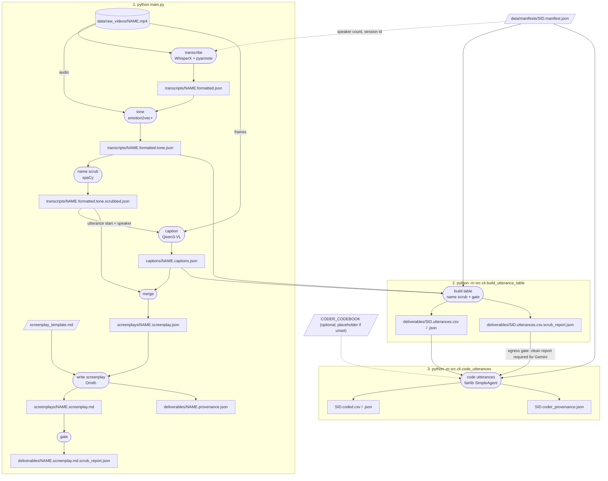

# FAIR Screenplay Utility

A utility run on local AI that turns video into a "screenplay" — a combined transcript of speech and on-screen action — for use by researchers or other LLM classifiers.

**De-identification is a core design constraint, not an add-on.** The tool is meant to run on video containing PII, and its output must not let a reader re-identify anyone: no appearance, name, or on-screen text/signage — only speaker labels (`SPEAKER_NN`), gaze/orientation, and behavior. Pronouns and gender words are acceptable content (study-team ruling, 2026-09-16); the caption and screenplay prompts still avoid them so actions stay pinned to `SPEAKER_NN`. Enforcement is layered (see `docs/DATA_MODEL.md` and `docs/LEAK_TAXONOMY.md`): anonymization rules folded into every prompt, a deterministic NER scrub that replaces spoken names before any downstream model sees dialogue, a warn-only regex spot-check mid-pipeline, and an enforcing gate at the end — a deliverable with findings is *blocked* (typed error, findings persisted for human review), never shipped on a warning.

## Models

Everything runs locally except the optional Gemini coder. No model is trained or fine-tuned on project data; only prompts change.

| Step | Model | Size | Role | Runs via |
|---|---|---|---|---|
| Speech to text | [Whisper large-v2](https://github.com/m-bain/whisperx) (WhisperX) | 1.5B | Transcribes dialogue | PyTorch, GPU |
| Word timing | wav2vec2 base 960h (torchaudio) | 95M | Aligns each word to a timestamp | PyTorch |
| Who spoke when | [pyannote speaker-diarization-community-1](https://huggingface.co/pyannote/speaker-diarization-community-1) | small | Assigns `SPEAKER_NN` labels (gated, needs `HF_TOKEN`) | PyTorch, GPU |
| Vocal tone | [emotion2vec+ large](https://huggingface.co/emotion2vec/emotion2vec_plus_large) | 300M | One emotion label per utterance | `funasr`, CPU is fine |
| Name scrub | spaCy `en_core_web_sm` | 12 MB | Replaces spoken names, places and organizations with `[NAME]`/`[PLACE]`/`[ORG]` | CPU, deterministic |
| Visual captions | [Qwen3-VL-8B-Instruct](https://huggingface.co/Qwen/Qwen3-VL-8B-Instruct) (`qwen3-vl-instruct-16k`, Q4_K_M) | 8.8B | Describes gaze, posture and gesture per sampled frame | Ollama, one GPU |
| Screenplay writer | [Ornith-1.5-35B-A3B](https://huggingface.co/ornith-ai/Ornith-1.5-35B-A3B) (`ornith-1.5-255k`, Q8_0) | 35.5B MoE, 3B active | Merges transcript, tone and captions into the screenplay | Ollama, about 60 GB GPU at 262k context |
| Behavior coder (default) | Qwen2.5-14B-Instruct (`qwen2.5:14b`, Q4_K_M) | 14.8B | Codes AO/PO/PE/NE/I/Apology per utterance | Ollama via fairlib |
| Behavior coder (optional) | Gemini 3.5 Flash | hosted | Same coding; leaves the machine, so only behind the egress gate | Gemini API via fairlib |

Model tags, contexts and sampling are set in `.env` (see `.env.example`); every run records the exact model digests in its provenance file.

## Data flow

Three commands, each consuming the files the previous one wrote. Rounded boxes are steps, square boxes are files they write, slanted boxes and the cylinder are inputs you provide; `NAME` is the video's base name and `SID` is the manifest's session id.



All paths are under `data/`. Video, audio, transcripts, captions and gate excerpts (`data/gate/`) never leave the machine; only the gate-clean, human-reviewed files from steps 1-3 are shared (screenplay, utterance table, coded table, provenance, scrub reports). Before sharing, also run the faithfulness check and read every file (checklist in `docs/OSU_GUIDE.md`).

## Setup

```
pip install -r requirements.txt
python -m spacy download en_core_web_sm
```

This includes `fair-llm` (import name `fairlib`) from PyPI, pinned to the release the coder stage was verified against.

Requires a local [Ollama](https://ollama.com/download) install running in the background for the captioning, screenplay and coder stages, with the models above pulled or created (`ollama create` from the `Modelfile.*` files in the repo; Ornith is not on the public Ollama registry and must already exist locally). WhisperX, pyannote and emotion2vec+ need the PyTorch/`funasr` stack.

Copy `.env.example` to `.env` and fill in `HF_TOKEN` (needed for the pyannote diarization model; the gated-model acceptance steps are in `docs/SETUP_HF_MODELS.md`). On a GPU box set `WHISPERX_DEVICE=cuda`, `WHISPERX_COMPUTE_TYPE=float16` and `WHISPERX_MODEL=large-v2`.

## Usage

Run from the repo root. The example is the public-domain mock-jury clip, session `s001`; substitute your video, manifest and session id.

**1. Video to screenplay** (transcribe, tone, name scrub, caption, merge, screenplay, gate):

```
python main.py data/raw_videos/MockTrial_trimmed.mp4 \
    --manifest data/manifests/s001.manifest.json --run-id run5_mocktrial
```

A startup preflight validates the config, token and required models before any expensive work begins. `--from {tone,caption,merge,screenplay}` resumes from persisted stage outputs after a crash.

**2. Utterance table + gate** (one row per utterance in OSU's coded-transcript columns, plus role, tone and non-verbal notes):

```
python -m src.cli.build_utterance_table \
    data/captions/MockTrial_trimmed.captions.json \
    data/transcripts/MockTrial_trimmed.formatted.tone.json \
    data/manifests/s001.manifest.json --run-id run5_mocktrial
```

A blocked gate stops here with the findings in `data/gate/`; after a person reviews them, rerun with `--cleared-by <role>`.

**3. Behavior codes** (local model by default; nothing leaves the machine):

```
python -m src.cli.code_utterances data/deliverables/s001.utterances.json \
    --manifest data/manifests/s001.manifest.json \
    --scrub-report data/deliverables/s001.utterances.csv.scrub_report.json \
    --output-dir data/deliverables
```

Until OSU's codebook is loaded (`CODER_CODEBOOK`, template `docs/codebook.example.json`) the coder uses a placeholder codebook and says so. `CODER_PROVIDER=gemini` sends rows to Gemini and is refused unless the session is public-domain footage with a clean gate report (`docs/adr/0001-egress-gate.md`). The other `CODER_*` levers are documented in `.env.example`.

**Faithfulness check** (run on every screenplay before sharing; exits nonzero on failure):

```
python -m src.cli.check_screenplay \
    data/screenplays/MockTrial_trimmed.screenplay.md \
    data/screenplays/MockTrial_trimmed.screenplay.json
```

### Other tools

Score a coding against a reference (per-code precision, recall, F1 and Cohen's kappa), and import an OSU coded-transcript workbook to code OSU's own sessions:

```
python -m src.cli.evaluate_coding <candidate.coded.json> <reference.xlsx> --candidate-id <id> --reference-id <id>
python -m src.cli.import_osu_transcript <workbook.xlsx> --session-id <id>
```

`docs/OSU_GUIDE.md` is the step-by-step guide for running all of this at OSU, with the checklist to clear before anything is shared. Each stage can also be run on its own as a module — see `CLAUDE.md` for the full list of `src/cli/` entry points.

## Development

```
python -m pytest tests/ -q
ruff check --isolated --select E4,E7,E9,F,I,UP,B,C4,RUF --target-version py311 src tests main.py
```

CI runs both on every push and pull request. Changes are tracked in `CHANGELOG.md`.
